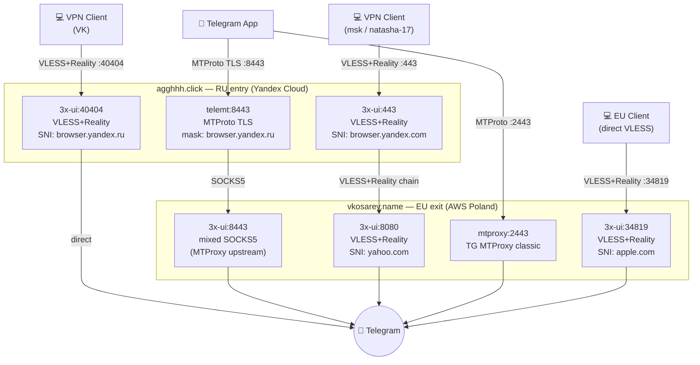
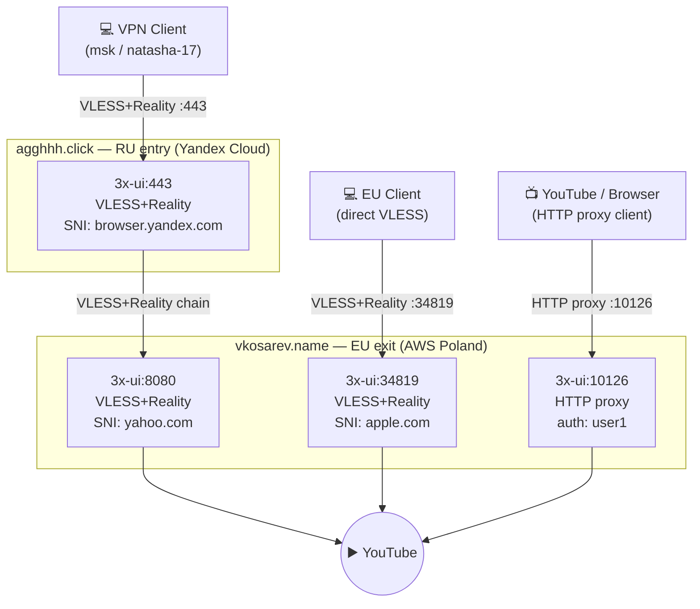

# vps

Репозиторий содержит конфигурации сервисов для двух VPS-хостингов, управляемых через Docker Compose.

## Серверы

| Хостинг | Провайдер | Назначение |
|---|---|---|
| `vkosarev.name` | AWS | Основной сервер: Xray VPN, MTProxy, мониторинг |
| `agghhh.click` | Yandex Cloud | Фронтенд-узел: Xray VPN, MTProxy (multi-hop) |

---

## Схема прокси-инфраструктуры

Подробная архитектура со всеми режимами работы: **[proxy-architecture.md](proxy-architecture.md)**

### Telegram



### YouTube




---

## Сервисы по хостингам

### vkosarev.name

| Сервис | Образ | Порты | Назначение |
|---|---|---|---|
| `3x-ui` | `ghcr.io/mhsanaei/3x-ui` | 443, 2055, 8080, 8443, 34819 | Xray VPN панель (VLESS+Reality) |
| `3x-ui` (http-proxy) | `ghcr.io/mhsanaei/3x-ui` | 10126 | HTTP-прокси для YouTube/браузера |
| `mtproxy` | `telegrammessenger/proxy` | 2443 | Telegram MTProxy (выходной узел) |
| `prometheus` | `prom/prometheus` | 9090 (localhost) | Сбор метрик |
| `grafana` | `grafana/grafana` | 3000 | Дашборды мониторинга |
| `portainer` | `portainer/portainer-ce` | 9443 | Управление Docker |
| `iperf3` | `networkstatic/iperf3` | 5201 | Замер пропускной способности |
| `mermaid` | `johnsinclair73/mermaid-live-editor` | 3200 | Редактор диаграмм |
| `node_exporter` | *(systemd, не Docker)* | 9100 | Метрики хоста для Prometheus |

### agghhh.click

| Сервис | Образ | Порты | Назначение |
|---|---|---|---|
| `3x-ui` | `ghcr.io/mhsanaei/3x-ui` | 443, 2077, 40404 | Xray VPN панель |
| `telemt` | *(собирается из Dockerfile)* | 8443, 9091 | MTProxy фронтенд (multi-hop) |
| `portainer` | `portainer/portainer-ce` | 9443 | Управление Docker |

---

## Структура репозитория

```
.
├── setup.sh                   # Общий скрипт начальной настройки хоста
│                              # (docker-compose-v2, node_exporter, git remote)
├── vkosarev.name/
│   ├── docker-compose.yml
│   ├── 3x-ui/db/              # БД панели Xray (x-ui.db)
│   ├── mtproxy/data/          # Данные MTProxy (секрет)
│   ├── portainer/data/        # Данные Portainer
│   ├── prometheus/            # Конфиг и данные Prometheus
│   └── grafana/data/          # Данные Grafana
└── agghhh.click/
    ├── docker-compose.yml
    ├── 3x-ui/db/              # БД панели Xray (x-ui.db)
    ├── telemt/
    │   ├── Dockerfile         # Собирает telemt из GitHub releases
    │   └── data/              # Конфиг и секрет telemt
    └── portainer/data/        # Данные Portainer
```

---

## Начальная настройка нового хоста

```bash
# 1. Положить GitHub PAT токен
echo "ghp_xxx" > ~/.github.token

# 2. Клонировать репозиторий
git clone https://github.com/vadim-kosarev/vps.git /root/vps
cd /root/vps

# 3. Запустить setup.sh (устанавливает docker-compose-v2, node_exporter, настраивает git)
sudo bash setup.sh

# 4. Запустить сервисы нужного хостинга
cd /root/vps/vkosarev.name   # или agghhh.click
cp .env.example .env          # заполнить переменные
docker compose up -d
```

---

## Переменные окружения

Каждая директория хостинга содержит `.env.example` — шаблон с описанием переменных.  
Реальный `.env` не коммитится в репозиторий.

Ключевые переменные:

| Переменная | Описание |
|---|---|
| `CERT_DIR` | Путь к папке с TLS-сертификатами (монтируется во все контейнеры) |
| `GRAFANA_ADMIN_PASSWORD` | Пароль администратора Grafana |

---

## SSH-подключение (Windows)

```powershell
# vkosarev.name
plink -load "vkosarev.name" -i "Z:\MY\vk-amazon-2023-private.ppk" -batch "команда"

# agghhh.click
plink -i "Z:\MY\vk-amazon-2023-private.ppk" -batch -l vaduhann `
  -hostkey "SHA256:IzR02mcCTg2YMg2ruQ0gNPpDfJZOK1UmrZ1L65530b8" agghhh.click "команда"
```
